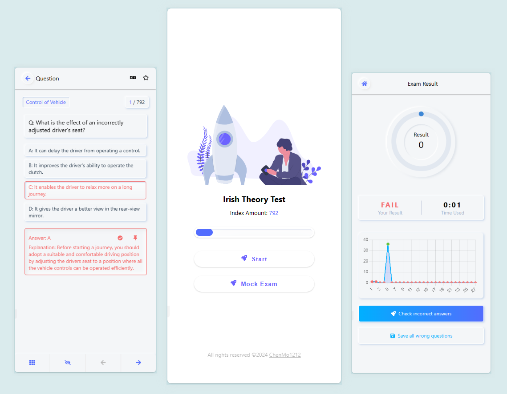

# Irish_Drive_Theory_Test

A website for the Irish driving license theory test

<p>
    <a href="https://chenmo1212.cn/driver?f=github" target="_blank">
        
    </a>
    <a href="https://github.com/Chenmo1212/Irish_Drive_Theory_Test" target="_blank">
        
    </a>
    <a href="https://github.com/Chenmo1212/Irish_Drive_Theory_Test/issues" target="_blank">
        
    </a>
    <a href="https://github.com/Chenmo1212/Irish_Drive_Theory_Test/pulls" target="_blank">
        
    </a>
    <a href="/"></a>
    <a href="https://github.com/Chenmo1212/Irish_Drive_Theory_Test" target="_blank">
        
    </a>
<br/>
<br/>
    <a href="https://github.com/Chenmo1212/Irish_Drive_Theory_Test" target="_blank">
        
    </a>
    <a href="https://github.com/Chenmo1212/Irish_Drive_Theory_Test" target="_blank">
        
    </a>
    <a href="https://github.com/Chenmo1212/Irish_Drive_Theory_Test" target="_blank">
        
    </a>
    <a href="https://github.com/Chenmo1212/Irish_Drive_Theory_Test" target="_blank">
        
    </a>
</p>



## Description

This React application is a practice tool for the Irish Theory Test, designed to help users prepare effectively for
their driving theory exam. It features a bilingual interface in English and Chinese, allowing users to toggle between
languages for better understanding.

### Features

- Bilingual interface (English and Chinese)
- Study All The Questions
- Add Questions to Your Favorite
- Filter By Category
- Review Your Wrong Answer
- Keep track your progress
- Save difficult questions for later revision
- Complete Mock Theory Test

You can check the website [here](https://chenmo1212.cn/driver?f=github).

## Installation

To set up the project locally, follow these steps:

1. Clone the repository:

   ```cmd
   https://github.com/Chenmo1212/Irish_Drive_Theory_Test
   ```

2. Navigate to the project directory:

   ```cmd
   cd Irish_Drive_Theory_Test
   ```

3. Install the required dependencies:

   ```cmd
   npm install
   ```

4. Run the application:
   ```cmd
   npm start
   ```

This will start the application in development mode on http://localhost:3000. Open your browser and navigate to this
address to view and interact with the app.

## Contributing

Contributions are welcome! Please feel free to submit a pull request or open an issue if you find a bug or have a
suggestion for a new feature.

## License

This project is licensed under the MIT License.
